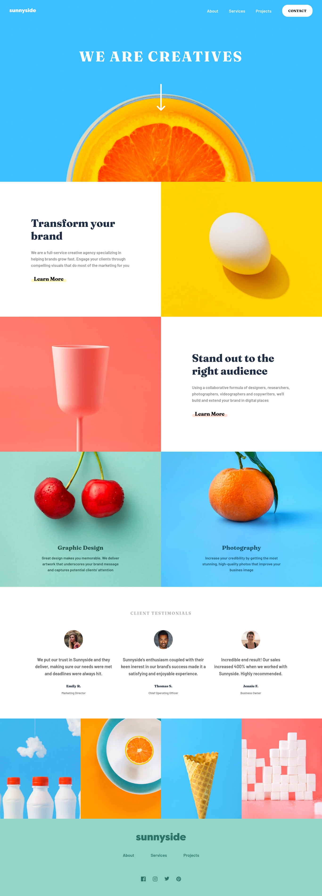
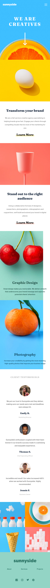

# Frontend mentor - Sunnyside landing page solution

This is a solution to the [Frontend Mentor](https://www.frontendmentor.io/challenges/sunnyside-agency-landing-page-7yVs3B6ef). 

## Table of contents 

- [Overview](#overview)
  - [The challenge](#the-challenge)
  - [Screenshot](#screenshot)
  - [Links](#links)
- [My process](#my-process)
  - [Built with](#built-with)
  - [What I learned](#what-i-learned)
  - [Continued development](#continued-development)
- [Author](#author)
- [Acknowledgments](#acknowledgments)

## Overview

### The challenge

Users should be able to:

- View the optimal layout for the site depending on their device's screen size (1440px and 375px)
- See hover states for all interactive elements on the page
# Challenge Startup Landing Page

To get all the images we recommend you go to [Frontend Mentor](https://www.frontendmentor.io/challenges/sunnyside-agency-landing-page-7yVs3B6ef) to sign up and get all the images! It is completely FREE!

### Screenshot

### Links

- Solution URL: [check the project soluction here](https://github.com/Jean-kassyl/sunnyside-landingPage)
- Live Site URL: [live site demo](https://jean-kassyl.github.io/sunnyside-landingPage/)

## My process

### Built with

- Semantic HTML5 markup
- CSS custom properties
- Flexbox

### What I learned
This project despite it's simplicity was a little bit challenging. 
Some of the challenges were around how to place the arrow and make it look exactly
as the same as on the provided design. 
I had to review flexbox properties, css position and many more.

### Continued development

I think I have to continue working on the basics(HTML and CSS)

## Author

- LinkedIn - [Jean Marc Kassyl Covi](https://www.linkedin.com/in/jean-marc-kassyl-covi-892548204/)

## Acknowledgments

This project was only possible because of Frontend mentor. I address My sincere thank to them as they are working hard to make us better developers.

